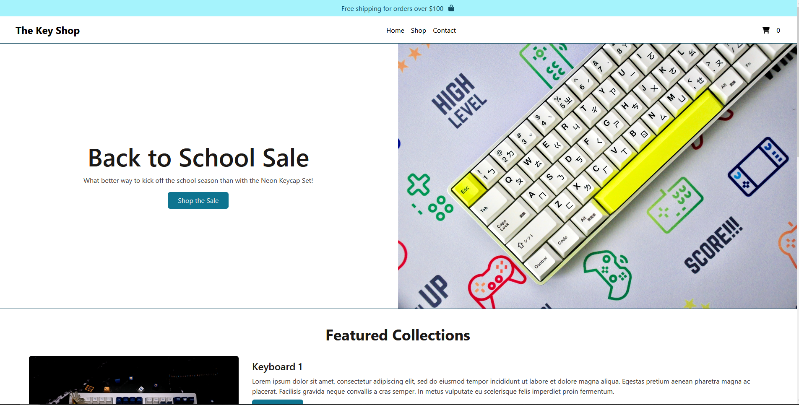
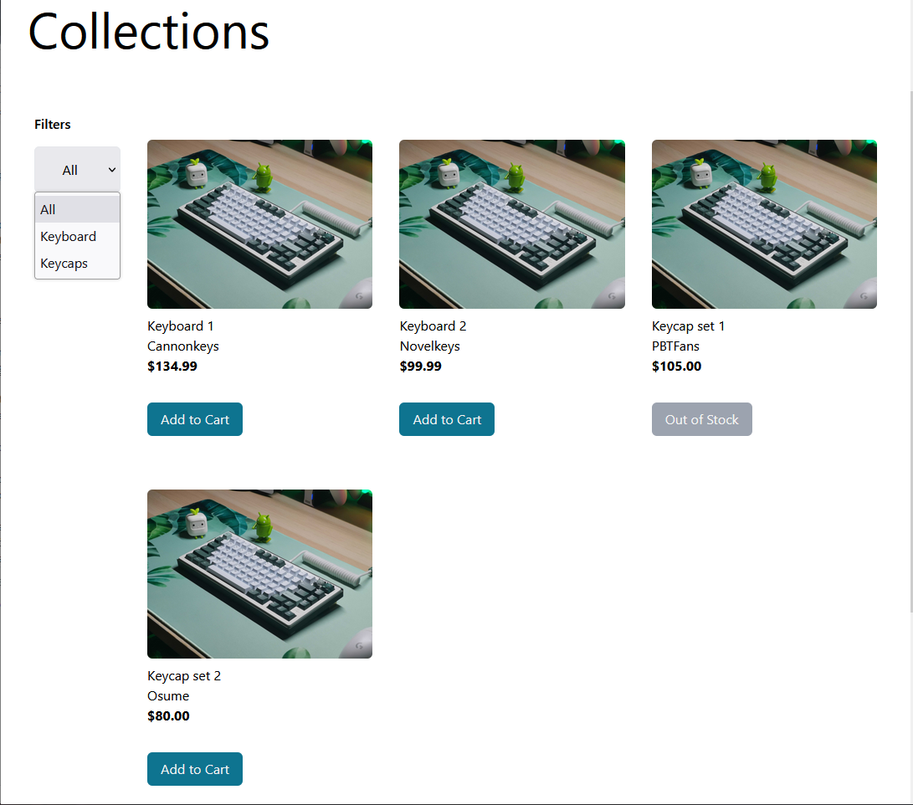
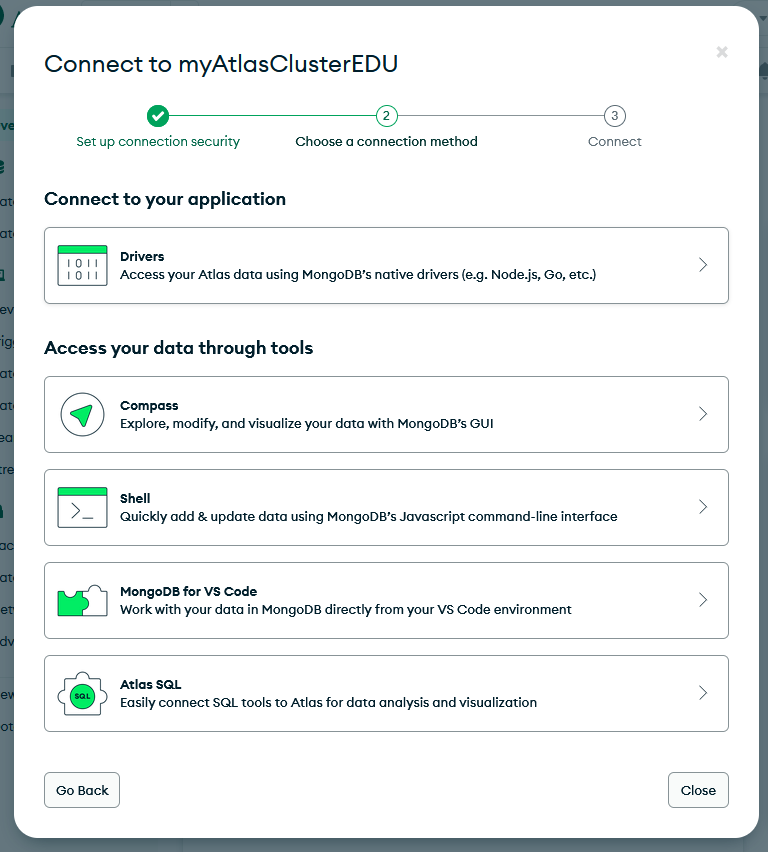

# The Key Shop

## Inspiration 
As a keyboard enthusiast, I frequent a lot of custom keyborad sites. Some great examples are CannonKeys, Novelkeys, and Osume. Each site has their own personalized style that is characteristic to their brand. I drew a lot of inspiration from Osume regarding the design layout and casual website copy. The accessible blue coloring was largely inspired by Cannonkeys and Novelkeys both who lean heavily on a blue color palette and straight forward product cards that allow customers to view pricing, product, and in stock easily.

## Frameworks, Languages, and Software Used 
 


## Features 
- Responsive Web Design
- View all In stock Products pulled from database 
- Filter products by category
- If ```inStock``` boolean is false in database, add to cart will display as disabled "Out of Stock"
- Add Products to cart
- Cart displays subtotal before tax calculations

## Visuals
When customers go to the live site, they are greeted with Back to School sale promotion.

 

Below is a screenshot featuring the Collections page with the active dropdown menu. 



## Local Environment setup
In order to setup, The Key Shop on your computer, first fork and clone the repository.

### Setting Up MongoDB

This project uses MongoDB. You must have a MongoDB account and an active Cluster to be able to navigate the server end. If you don't already have an account you can visit [here](https://www.mongodb.com/cloud/atlas/register) to make one.

Once logged into your MongoDB account, click **Connect**. Then, select to connect to your application via **Drivers**. 



Make sure the driver is selected to Node.js and follow the steps to get your connection string.

This project makes use of the ```dotenv``` npm package. Save your connection string in a .env file with your connection string in the following format: 

```MONGODB_URI=your_connection_string ``` where ```your_connection_string``` is the connection string you copy and pasted from the website.

### Starting the Vite and Express Server

Open 2 terminals.

In the first terminal, change directories to client: 

``` cd client/ ```

``` npm install ```

In the second terminal, change directories to server: 

```cd server/```

``` npm install```

Once the dependencies are installed, run ```npm run dev``` to start the client and server up synchronously. Nodemon and Vite will allow you to see live changes as they are saved.

## Task List 
- [x] Replace Lorem Ipsum with Website copy
- [x] Integrate Hamburger Menu for Smaller Screen Sizes
- [ ] Add feature for Customer to edit quantity of items in their cart
- [ ] Add delete button if Customer wants to remove an item from their cart
- [ ] Optimize fetch data from database 
- [ ] Fix Bug on Product Page where footer does not reach the bottom

## Authors
Full Stack Engineer: [Kelsey Hughes](https://github.com/kelbri10)

## License 